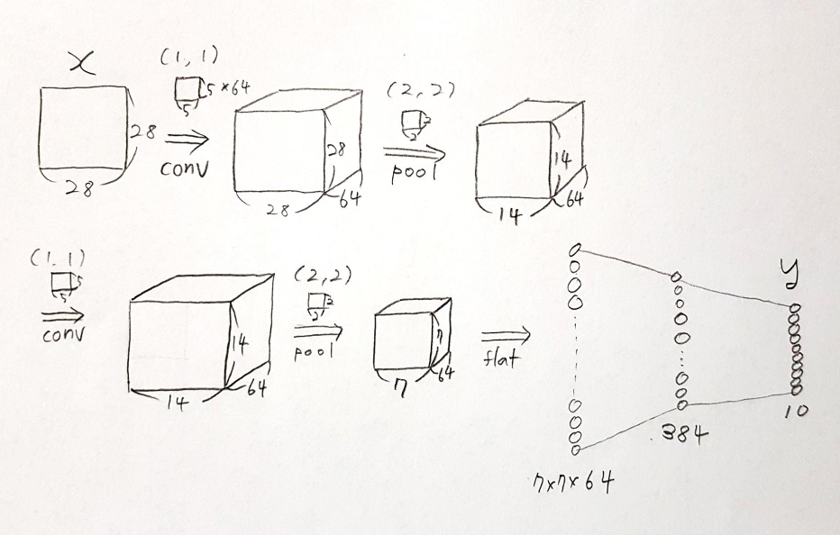

# KNU 딥러닝 특강 [2019.02.25~28]

## [2019.02.25] Python & numpy

[딥러닝(Deep-Learning)을 위한 프로그램 설치](https://m.post.naver.com/my/series/detail.nhn?memberNo=8098532&seriesNo=459452&prevVolumeNo=15102526)

아래 링크의 포스트를 순서대로 따라가면서 그래픽 드라이버, CUDA, CUDNN, Anaconda, tensorflow 를 설치한다.
내 노트북의 그래픽카드는 GeForce MX150 이므로 tensorflow_gpu-1.12.0 을 설치하기 위해 CUDA 9.0을 설치하고, 이에 맞추어 CUDNN 7.4.2의 라이브러리를 다운받아 추가하였다.
또한 CUDA 9.0이 Python 3.7을 지원하지 않으므로 Python의 버전을 3.6.8로 다운그레이드하였다.
가상환경 상의 파이썬에서 tensorflow를 구동시키기 위하여 Anaconda3을 설치한다.


### Colab
구글에서 제공하는 Jupyter notebook 기반의 온라인 딥러닝 구동 환경이다. 구글 드라이브, Github 등과 연동하여 사용할 수 있어 편리하다.
교육, 학습용으로 제공되는 서비스이기 때문에 일정 시간이상 딥러닝을 구동시키면 실행이 초기화된다.
하지만 이는 tensorflow의 기본적인 기능을 학습하는 데에 큰 지장은 없다.


## [2019.02.26] MLP

MLP : Mulitlayered Perceptron
### Tensor Declaration
```python
import tensorflow as tf
import numpy as np

sess = tf.Session()

row_dim = 2
col_dim = 3
zero_tsr = tf.zeros([row_dim, col_dim])
ones_tsr = tf.ones([row_dim, col_dim])
filled_tsr = tf.fill([row_dim, col_dim], 42)
constant_tsr = tf.constant([1, 2, 3])
print(zero_tsr, '\n', ones_tsr, '\n', constant_tsr, '\n')
print(sess.run(zero_tsr), '\n\n', sess.run(ones_tsr), '\n\n', sess.run(filled_tsr), '\n\n', sess.run(constant_tsr))

linear_tsr = tf.linspace(start=0., stop=1., num=5)
int_seq_tsr = tf.range(start=0, limit=10, delta=2)
print(linear_tsr)
print(int_seq_tsr)
print(sess.run(linear_tsr))
print(sess.run(int_seq_tsr))

randunif_tsr = tf.random_uniform([row_dim, col_dim], minval=0, maxval=1)
print(randunif_tsr) 
print(sess.run(randunif_tsr))

randnorm_tsr = tf.random_normal([row_dim, col_dim], mean=0.0, stddev=1.0)
print(randnorm_tsr)
print(sess.run(randnorm_tsr))

truncnorm_tsr =tf.truncated_normal([row_dim, col_dim], mean=0.0, stddev=1.0)
print(truncnorm_tsr)
print(sess.run(truncnorm_tsr))
```
### Variables
* 텐서플로우가 알고리즘을 최적화하기 위해 어떻게 이들을 변화시키는지 계속 추적할 수 있게하는 알고리즘의 매개변수

#### Variables from tensors
* 주로 인공신경망의 가중치와 같은 학습가능한 매개변수들
* 텐서를 감싸므로써 대응하는 변수를 생성한다
```python
my_var = tf.Variable(tf.zeros([row_dim, col_dim]))
print(my_var)
```
```
<tf.Variable 'Variable_2:0' shape=(2, 3) dtype=float32_ref>
```

#### Variables form numpy arrays, or constant

#### Variables initailization method
* 가장 대표적인 방법은 global_variables_initialize() 메소드인데, 이는 그래프 안에서 우리가 만든 모든 변수를 초기화시키는 연산을 생성한다
* 또는 한 변수를 다른 변수를 초기화한 결과를 기반으로 초기화려면 다음과 같이 할 수 있다
```python
sess = tf.Session()
first_var = tf.Variables(tf.zeros([2, 3]))
sess.run(first_var.initializer)
second_var = tf.Variable(tf.zeros_like(first_var))  # first_var 에 의존
sess.run(second_var.initializer)
```

#### Placeholders
* 특정한 타입이나 모양의 데이터를 feed in 할 수 있게 해주는 객체
* 연산의 예상된 결과와 같은 computational graph의 결과에 의존
* 그저 그래프 안에 feed in 되기 위한 자리만을 잡고 있음
* 세션에서 feed_dict 인자를 통하여 데이터를 얻는다

```python
sess = tf.Session()
x = tf.placeholder(tf.float32, shape=[2, 2])
y = tf.identity(x)

x_vals = np.random.rand(2, 2)
sess.run(y, feed_dict={x:x_vals})          # 데이터를 feed 만 한다
temp = sess.run(y, feed_dict={x:x_vals})   # 데이터를 feed 하고 temp 에 그 값을 저장한다

print(x_vals)
print(temp)
```
```
[[0.53452392 0.16960416]
 [0.89727193 0.99758985]]
[[0.5345239  0.16960415]
 [0.89727193 0.9975898 ]]
 ```

## [2019.02.27] CNN

CNN : Convolutional Neural Network

### MNIST 
#### Load and preprocess data

```python
# Load the necessary package

import tensorflow as tf
import numpy as np
from tensorflow.keras.datasets.mnist import load_data


# Packages and Data

# Load MNIST data
(x_train, y_train), (x_test, y_test) = load_data()

# Transform to 4-dim tensors
print(x_train.shape)    # (60000, 28, 28)
x_train = np.expand_dims(x_train, axis=-1)   # axis=-1 : 텐서의 맨 뒤(인덱스:-1)를 expand
x_test = np.expand_dims(x_test, axis=-1)
print(x_train.shape)    # (60000, 28, 28, 1)

# Normalization [0, 255] -> [0,1]
print(x_train.max())
x_train = x_train / 255
x_test = x_test / 255
```
#### Network

```python
# Allocate placeholders for I/O
x = tf.placeholder(tf.float32, shape=[None, 28, 28, 1])
y = tf.placeholder(tf.int64, shape=[None])

# Integer label -> Binary, one-hot label
y_onehot = tf.one_hot(y, 10)
print(y_onehot.shape)

# Dropout probability
keep_prob = tf.placeholder(tf.float32)
```



```python
# Network Setting

# Convolution layer 1
# tf.truncated_normal : 2시그마 내의 정규분포
W_conv1 = tf.Variable(tf.truncated_normal(shape=[5, 5, 1, 64], stddev=5e-2)) 
# [5, 5, 1, 64] : 흑백이라서 1 => 컬러면 rgb 채널 3개 추가 : [5, 5, 4, 64]
b_conv1 = tf.Variable(tf.constant(0.1, shape=[64]))
h_conv1 = tf.nn.relu(tf.nn.conv2d(x, W_conv1, strides=[1, 1, 1, 1], padding='SAME') + b_conv1)
h_pool1 = tf.nn.max_pool(h_conv1, ksize=[1, 2, 2, 1], strides=[1, 2, 2, 1], padding='SAME')

# Convolution layer 2
W_conv2 = tf.Variable(tf.truncated_normal(shape=[5, 5, 64, 64], stddev=5e-2))
b_conv2 = tf.Variable(tf.constant(0.1, shape=[64]))
h_conv2 = tf.nn.relu(tf.nn.conv2d(h_pool1, W_conv2, strides=[1, 1, 1, 1], padding='SAME') + b_conv2)
h_pool2 = tf.nn.max_pool(h_conv2, ksize=[1, 2, 2, 1], strides=[1, 2, 2, 1], padding='SAME')

# Fully connedted layer 1
W_fc1 = tf.Variable(tf.truncated_normal(shape=[7*7*64, 384], stddev=5e-2))
b_fc1 = tf.Variable(tf.constant(0.1, shape=[384]))
h_pool2_flat = tf.reshape(h_pool2, [-1, 7*7*64])
h_fc1 = tf.nn.relu(tf.matmul(h_pool2_flat, W_fc1) + b_fc1)
h_fc1_drop = tf.nn.dropout(h_fc1, keep_prob=keep_prob)

# Fully connected layer 2
W_fc2 = tf.Variable(tf.truncated_normal(shape=[384, 10], stddev=5e-2))
b_fc2 = tf.Variable(tf.constant(0.1, shape=[10]))
logits = tf.matmul(h_fc1_drop, W_fc2) + b_fc2
y_pred = tf.nn.softmax(logits)


# LOSS AND OPTIMIZER

# Cross entropy loss with doftmax output
loss = tf.reduce_mean(tf.nn.softmax_cross_entropy_with_logits_v2(labels=y_onehot, logits=logits))

# Adam optimizer
train_step = tf.train.AdamOptimizer(1e-4).minimize(loss)

# Accuracy calculation
correct_prediction = tf.equal(tf.argmax(y_pred, 1), y)
accuracy = tf.reduce_mean(tf.cast(correct_prediction, tf.float32))

```
#### Training
```python
# LEARGNING STEPS

with tf.Session() as sess:
    sess.run(tf.global_variables_initializer())
    for i in range(10000):
        idx = np.random.randint(x_train.shape[0], size=128)
        batch = (x_train[idx], y_train[idx])
        if i%100==0:
            train_accuracy = sess.run(accuracy, feed_dict={x:batch[0], y:batch[1], keep_prob:1.})
            loss_print = loss.eval(feed_dict={x:batch[0], y:batch[1], keep_prob:1.})
            print("step:%d, acc:%f, loss:%f" %(i, train_accuracy, loss_print))
        sess.run(train_step, feed_dict={x:batch[0], y:batch[1], keep_prob:0.5})
    test_accuracy = accuracy.eval({x:x_test, y:y_test, keep_prob:1.})
    print("test acc:%f" %test_accuracy)
```


